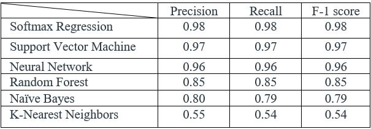
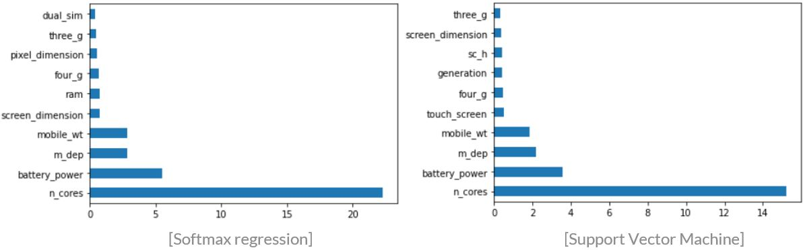

# Classifying Mobile Prices Based on Specifications

>  Subtitle: What makes mobile prices high or low?
>  
>  Author: Seyoung Jung

### __Introduction:__
Today, the rapid development of technology allows electronics companies to launch new products to customers. Especially, many consumers periodically update their smart phones, and therefore, the electronics market is highly competitive to attract shoppers. The best interest of consumers is better performance with lower price. Hence, determining reasonable price is a very important factor for businesses. Also, customers tend to want to judge if the price of the item is reasonable based on the specifications that they are interested in. Therefore, the goal of this data analysis project is to build machine learning models that classify price of the cell phones into four different segments (low cost, medium cost, high cost, and very high cost) based on various specifications.

### __Abstract:__
The dataset used for this project was obtained from [Kaggle](https://www.kaggle.com/iabhishekofficial/mobile-price-classification). The dataset is comprised of a total of 21 features, including the batter power, internal memory, weight, RAM, etc. And the target variable is an ordinal categorical variable (segments of selling price) which has values from 0 to 3 (0 indicates low cost). More detailed descriptions of the data can be found in the link above. The anticipated issue is that, since the total number of observations (rows) is only 3000, the models fit to the data might not perform perfectly. This project first performs exploratory data analysis to better understand the data. And it does feature engineering if necessary. After that, it builds multiple machine learning models, including softmax regression, neural network, support vector machine, random forest, naïve bayes, and k-nearest neighbors. Each model will be evaluated based on the precision, recall, and the F-1 score. Of the six listed algorithms, the first three algorithms achieve scores greater than 0.90 in the three evaluation metrics. 

### __Directory:__
- Notebook: In order to see the process of this project with explanations and interpretations, please see the jupyter notebook file, named "mobile_prices_notebook" in this repository. 
- Code file: If you want to see code only, please see the the "mobile_prices_code" file. In order to use this file in the "code" folder, another file "mobile_feat_eng" is needed for feature engineering. 
- Data: In order to reproduce this project using the same data, please download the "train.csv" file. 

### __Methods:__

This data analysis project report is comprised of four components: 

- __Exploratory Data Analysis:__ This project performs exploratory data analysis to explore the data and find patterns within the data through visualizing features. One can find relations among the variables, spot anomalies, find their distributions, etc. 
- __Data Cleaning / Feature Engineering:__ In this subsection, it cleans and transforms the data to increase the productivity and the performance of machine learning models. We merge, for instance, by adding or multiplying some of features to make them more useful or drop redundant features to avoid overfitting. 
- __Model Building:__ In this project, 6 classification algorithms are implemented, including softmax regression, neural network, support vector machine, random forest, naïve bayes, and k-nearest neighbors. The algorithms that achieve at least 0.90 of accuracy are selected for further hyperparameter tuning processes to generate more accurate results. 
- __Discussion:__ Principal component analysis is performed to identify how much of variation is explained by the first N components. And the PCA outcome is compared to feature importance generated by the best performing algorithms to see how they differ each other. 

### __Conclusion:__

This project implements 6 different machine learning classification algorithms. Most of the algorithms here worked pretty well, considering there is a probability of 0.25 to correctly guess for each price range class. And as the organized table above shows, the softmax regression has outperformed other advanced algorithms such as neural network and random forest. 

One can compare the two feature importance plots generated based on the softmax regression and support vector machine. It can be observed that the order of importance is quite similar. By comparing the two plots, one can observe that that the importance of n_cores (the number of core processors) is much higher in the softmax regression. Also, contrary to expectations, the RAM does not contribute much to the classification algorithms.  

